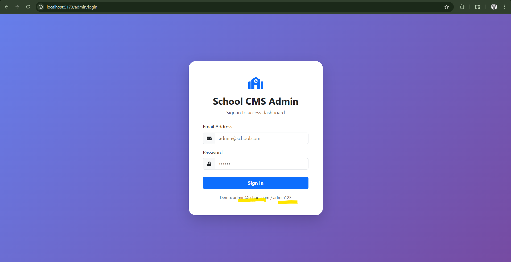

# 📚 School CMS / Blog Project



## 🚀 Project Overview

This is a dynamic **School CMS / Blog Application** built using modern web technologies.
It allows users to create pages, manage content, and dynamically render sections like banners, products, and services.

---

## ✨ Features

* 📄 Dynamic Page Creation
* 🧩 Modular Section System
* 🖼️ Image Upload Functionality
* ⚡ Fast & Responsive UI
* 🔄 API-based Content Rendering
* 📱 Mobile Friendly Design

---

## 🛠️ Tech Stack

* Frontend: React.js (Vite)
* Backend: Node.js + Express
* Database: MongoDB
* Styling: CSS / Tailwind (optional)

---
## ⚙️ Installation

```bash
git clone https://github.com/Subhasish94/school-blog.git
cd school-blog
npm install
npm run dev
```

---

## 📂 Project Structure

```
├── src/
│   ├── admin/
│   │   ├── components/
│   │   │   ├── AdminLayout.jsx
│   │   │   └── AdminSidebar.jsx
│   │   ├── pages/
│   │   │   ├── AdminDashboard.jsx
│   │   │   ├── AdminNews.jsx
│   │   │   ├── AdminBlog.jsx
│   │   │   ├── AdminPages.jsx
│   │   │   ├── AdminContacts.jsx
│   │   │   ├── AdminSettings.jsx
│   │   │   ├── AdminLogin.jsx
│   │   │   └── AdminError.jsx
│   │   └── admin.css
│   │
│   ├── frontend/
│   │   ├── components/
│   │   │   ├── Navbar.jsx
│   │   │   ├── Footer.jsx
│   │   │   ├── HeroSection.jsx
│   │   │   └── NewsCard.jsx
│   │   ├── pages/
│   │   │   ├── HomePage.jsx
│   │   │   ├── NewsArchive.jsx
│   │   │   ├── NewsDetail.jsx
│   │   │   ├── BlogArchive.jsx
│   │   │   ├── BlogDetail.jsx
│   │   │   ├── AboutPage.jsx
│   │   │   └── ContactPage.jsx
│   │   └── frontend.css
│   │
```

---

## 🎯 Future Improvements

* 🔐 Authentication System
* 🧑‍💼 Admin Dashboard
* 📊 Analytics Integration
* 🌐 SEO Optimization

---

## 🤝 Contributing

Pull requests are welcome. For major changes, please open an issue first.

---

## 📧 Contact

Created by **Subhasish**
Feel free to connect for collaboration 🚀

--
]
⭐ If you like this project, give it a star!
